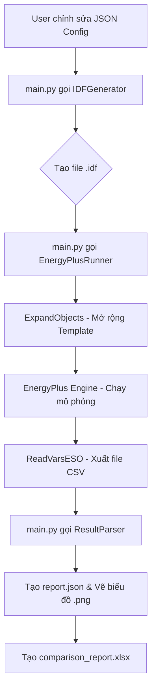

# Hướng dẫn sử dụng hệ thống mô phỏng EnergyPlus

Tài liệu này hướng dẫn bạn cách thiết lập, cấu hình và chạy mô phỏng năng lượng cho phòng IT bằng hệ thống tự động hóa dựa trên JSON và Python.

---

## 🏗️ 1. Cấu trúc thư mục & File cốt lõi (Core Files)

Hệ thống được thiết kế theo dạng module hóa. Dưới đây là các file quan trọng nhất:

### 📂 scripts/ (Logic chính)
- **`generators/idf_generator.py`**: Trái tim của hệ thống. Nó đọc các file JSON và chuyển đổi chúng thành file `.idf` mà EnergyPlus có thể hiểu được.
- **`runners/run_simulation.py`**: Điều khiển việc chạy EnergyPlus. Nó cũng xử lý các bước trung gian như `ExpandObjects` (mở rộng template) và `ReadVarsESO` (xuất file CSV).
- **`runners/batch_runner.py`**: Cho phép chạy nhiều kịch bản cùng lúc (song song) để tiết kiệm thời gian.
- **`parsers/result_parser.py`**: Đọc dữ liệu từ file CSV kết quả, tính toán các chỉ số (năng lượng, nhiệt độ) và vẽ biểu đồ.

### 📂 config/ (Dữ liệu đầu vào)
- **`building/`**: Chứa thông tin về hình học và vật liệu.
- **`scenarios/`**: Chứa các kịch bản test. Đây là nơi bạn sẽ làm việc nhiều nhất để thay đổi các giả định mô phỏng.

### 📂 Gốc (Entry Point)
- **`main.py`**: File thực thi chính. Bạn sẽ tương tác với hệ thống chủ yếu qua file này bằng các dòng lệnh.

---

## 🔄 2. Luồng hoạt động (Workflow Flow)

Hệ thống hoạt động theo một quy trình khép kín từ lúc bạn thay đổi cấu hình đến khi nhận được báo cáo:



---

## 🛠️ 3. Chuẩn bị hệ thống

### Cài đặt môi trường Python
Hệ thống yêu cầu Python 3.8+ và các thư viện hỗ trợ.
```bash
# Tạo môi trường ảo
python3 -m venv venv

# Kích hoạt môi trường ảo
source venv/bin/activate

# Cài đặt các thư viện cần thiết
pip install -r requirements.txt
```

### File thời tiết (Weather File)
Đảm bảo bạn đã có file thời tiết `.epw` cho địa điểm mong muốn.
- Vị trí lưu: `data/weather/`
- Tên file mặc định trong cấu hình hiện tại: `hanoi.epw`

---

## 📐 2. Cấu hình phòng (Configuration)

Các file cấu hình nằm trong thư mục `config/`:

1.  **`building/geometry.json`**: Định nghĩa kích thước phòng, vị trí (tọa độ), hướng nhà, và các bề mặt (cửa sổ, cửa ra vào).
    - *Lưu ý:* Khi thêm cửa sổ/cửa, hãy đảm bảo chúng nằm đúng trên mặt phẳng của tường tương ứng.
2.  **`building/materials.json`**: Định nghĩa các loại vật liệu xây dựng (thạch cao, bê tông, kính...) và cấu trúc các lớp tường/sàn/trần.
3.  **`hvac/hvac_config.json`**: Cấu hình hệ thống điều hòa, nhiệt độ đặt (setpoints) và công suất máy.
4.  **`schedules/schedules.json`**: Lịch trình hoạt động của con người, đèn chiếu sáng và thiết bị điện.

---

## 🌦️ 3. Kịch bản mô phỏng (Scenarios)

Các kịch bản nằm trong `config/scenarios/`. Mỗi kịch bản có thể ghi đè (override) các thông số từ cấu hình gốc:

- **`baseline.json`**: Kịch bản chuẩn để so sánh.
- **`energy_saving.json`**: Thử nghiệm các biện pháp tiết kiệm (tăng nhiệt độ điều hòa, dùng kính Low-E).
- **`high_occupancy.json`**: Thử nghiệm khi phòng có nhiều người và thiết bị hơn.

---

## 🚀 4. Chạy mô phỏng

Sử dụng script `main.py` để điều khiển hệ thống. **Luôn sử dụng python từ môi trường ảo.**

### Chạy tất cả kịch bản và so sánh (Khuyên dùng)
Lệnh này sẽ chạy song song các kịch bản, tự động xử lý các mẫu HVAC và tạo báo cáo so sánh.
```bash
venv/bin/python3 main.py run-all --parallel --compare
```

### Chạy một kịch bản duy nhất
```bash
venv/bin/python3 main.py run --scenario config/scenarios/baseline.json
```

---

## 📊 5. Xem kết quả

Sau khi chạy xong, kết quả sẽ được lưu tại `outputs/results/`:

- **`comparison_report.xlsx`**: File Excel so sánh các chỉ số năng lượng, nhiệt độ giữa các kịch bản.
- **Thư mục từng kịch bản (ví dụ `Baseline/`)**:
    - `eplusout.csv`: Dữ liệu chi tiết theo từng giờ.
    - `eplustbl.htm`: Báo cáo chi tiết dạng HTML (mở bằng trình duyệt).
    - `plots/`: Các biểu đồ nhiệt độ và năng lượng dạng hình ảnh (.png).

---

## 💡 Lưu ý kỹ thuật (Dành cho EnergyPlus 9.0.1)

Hệ thống đã được tối ưu hóa để tự động xử lý các vấn đề sau:
- **Tự động chạy `ExpandObjects`**: Nếu bạn sử dụng `HVACTemplate`, hệ thống sẽ tự động mở rộng chúng.
- **Chuyển đổi CSV**: Tự động chạy `ReadVarsESO` để bạn có file `.csv` ngay lập tức.
- **Định dạng RunPeriod**: Đã được sửa để tương thích với yêu cầu khắt khe về ngày tháng của phiên bản 9.0.1.

---

## 🆘 Giải quyết sự cố

Nếu mô phỏng thất bại, hãy kiểm tra file lỗi:
`cat outputs/results/<Tên_Kịch_Bản>/eplusout.err`

Hầu hết các lỗi liên quan đến hình học (cửa sổ nằm ngoài tường) hoặc thiếu file thời tiết.
